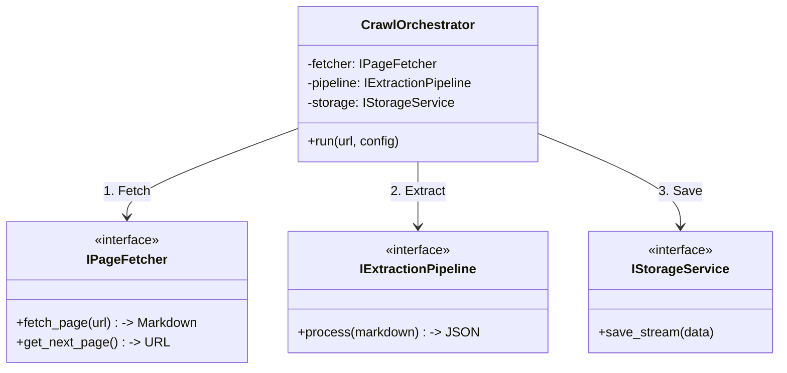

# Proposed Technical Skeleton (Refactored Architecture)

This document outlines the proposed "Clean Architecture" for the Universal Web Scraper. It focuses on modularity, maintainability, and scalability.

## 1. Directory Structure (Refactored)

```text
crawl-tool/
├── config/
│   ├── settings.py             # Global App Settings
│   └── sites/                  # [NEW] Site Config Plugins (YAML/JSON)
│       ├── batdongsan.yaml
│       ├── alonhadat.yaml
│       └── default.yaml
├── core/
│   ├── interfaces.py           # [NEW] Abstract Base Classes (Contracts)
│   ├── orchestrator.py         # [NEW] CrawlOrchestrator (The Manager)
│   ├── fetcher.py              # [NEW] PageFetcher (Browser/Network Layer)
│   ├── pipeline.py             # [NEW] DataProcessingPipeline (Split -> AI -> Validate)
│   └── job_service.py          # Job Queue Logic
├── ai/                         # [MOVED] AI Logic
│   ├── provider_interface.py   # [NEW] ILLMProvider (Contract)
│   ├── litellm_provider.py     # LiteLLM Implementation

├── database/
│   ├── repository.py           # SQLite Repository
│   └── models.py               # Data Models
├── ui/
│   ├── viewmodels/             # [NEW] MVVM Logic (Separates Logic from UI)
│   │   ├── base_viewmodel.py   # Common signals/properties
│   │   ├── main_viewmodel.py   # Parent VM (Orchestrator)
│   │   ├── crawl_viewmodel.py  # Logic for "Crawler" tab (Start/Stop, Progress)
│   │   ├── settings_viewmodel.py # Logic for Config (AI, Proxy)
│   │   └── job_viewmodel.py    # Logic for "Job Queue" tab
│   └── views/                  # [RENAMED] UI Widgets
│       ├── main_window.py      # Main Container (Shell)
│       ├── crawl_view.py       # Crawler Tab UI
│       ├── settings_view.py    # Settings Forms UI
│       └── job_view.py         # Job Table UI
└── utils/
    └── ...
```

## 2. Core Architecture Diagram (Orchestrator Pattern)

The **Orchestrator** acts as the conductor. It doesn't do the work itself; it delegates tasks to specialized workers (Fetcher, Extractor, Storage).



## 3. AI & Data Pipeline (The "Brain")

The extraction process is broken down into a linear pipeline. This makes it easy to add new steps (e.g., "Translate to English" or "Convert Currency") without breaking existing code.

```mermaid
graph LR
    Markdown[Raw Markdown] --> Cleaner[HTML Cleaner]
    Cleaner --> Splitter[Content Splitter]
    Splitter --> Batches[Text Batches]
    Batches --> AI[AI Provider (Interface)]
    AI --> JSON[Raw JSON]
    JSON --> Validator[Schema Validator]
    Validator --> CleanData[Clean Data]
```

## 4. Code Skeleton (Python)

### A. Core Interfaces (`core/interfaces.py`)

Defining contracts allows us to swap implementations easily (e.g., switch from Playwright to Selenium, or LiteLLM to LangChain) without changing the core logic.

```python
from abc import ABC, abstractmethod
from typing import Any, Dict, List, Optional

class IPageFetcher(ABC):
    @abstractmethod
    async def fetch(self, url: str) -> str:
        """Returns raw markdown content"""
        pass
    
    @abstractmethod
    def get_next_page_url(self) -> Optional[str]:
        """Resolves pagination"""
        pass

class ILLMProvider(ABC):
    @abstractmethod
    async def extract(self, content: str, schema: Dict) -> List[Dict]:
        """Returns extracted data based on schema"""
        pass

class IStorageService(ABC):
    @abstractmethod
    async def append(self, data: Any):
        """Streams data to disk/db"""
        pass
```

### B. The Orchestrator (`core/orchestrator.py`)

```python
class CrawlOrchestrator:
    def __init__(self, 
                 fetcher: IPageFetcher, 
                 extractor: ILLMProvider, 
                 storage: IStorageService):
        # Dependency Injection
        self.fetcher = fetcher
        self.extractor = extractor
        self.storage = storage

    async def run_job(self, start_url: str):
        current_url = start_url
        
        while current_url:
            # 1. Fetch
            print(f"Fetching {current_url}...")
            markdown = await self.fetcher.fetch(current_url)
            
            # 2. Extract (The extractor handles splitting internally or via pipeline)
            data = await self.extractor.extract(markdown)
            
            # 3. Save
            if data:
                await self.storage.append(data)
            
            # 4. Pagination
            current_url = self.fetcher.get_next_page_url()
```

### C. Site Configuration (`config/sites/batdongsan.yaml`)

Moving configuration out of Python code makes the system cleaner and allows non-coders to add support for new sites.

```yaml
domain: "batdongsan.com.vn"
pagination:
  selector: ".re__pagination-icon .re__icon-chevron-right"
  type: "click" # or "url_pattern"
content:
  exclude: 
    - ".ad-container"
    - "footer"
    - ".header"
scroll:
  enabled: true
  depth: 5
  delay: 2000
```
